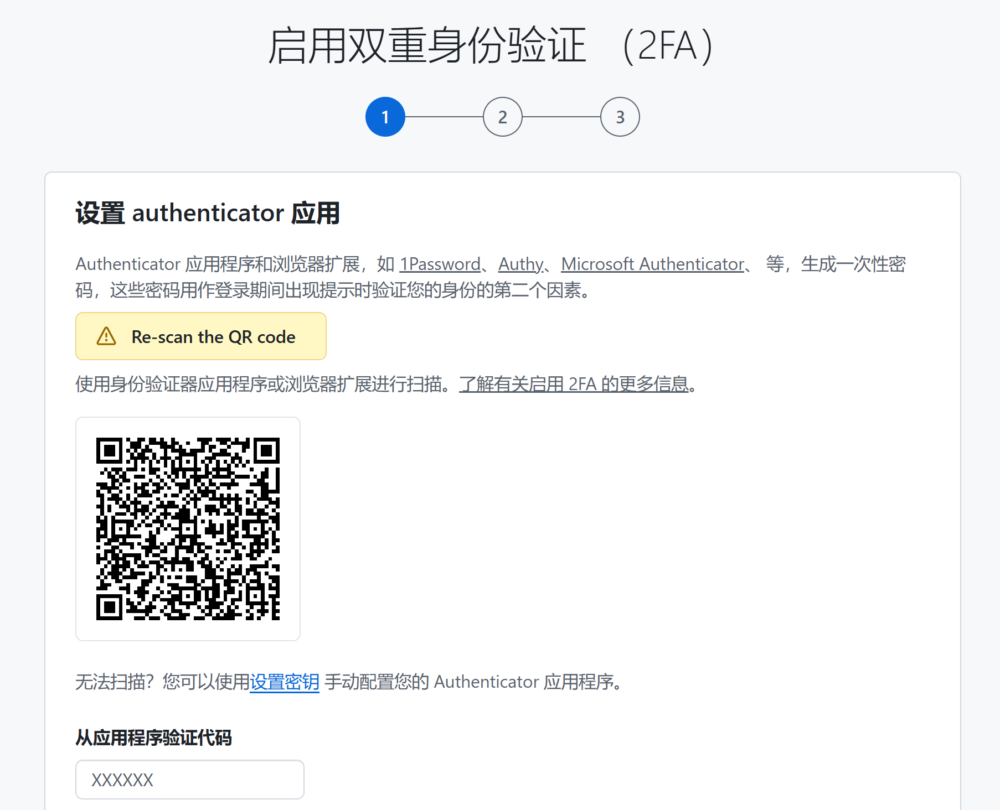

# 双重身份验证

github最新要求，所有账号都必须支持双因素验证。

## 一、验证App

本来支持app和手机号验证，但是github不支持中国区的手机号，只能选择app验证。

我们选择**Authenticator**，小米商店可下载

- ✅ 不强制手机号注册
- ❗注册用 Microsoft 账号
- ✅ 支持 Microsoft 账户绑定（可绑定国内手机号）
- ✅ 完全支持中文界面
- ✅ 安全性高，支持设备同步（需 Microsoft 账号）

## 二、恢复代码

你在 GitHub 上使用 Authenticator启用了双重身份验证（2FA）后，**GitHub 会提示你「Download your recovery codes」**，这是完全正常也非常重要的一步！

#### 什么是恢复代码？

它们是 GitHub 提供给你的**备用验证码**，用于以下场景：

- 你手机丢了
- Authenticator App 无法访问
- 无法接收验证码时登录账号

每个恢复码是一次性的，但你会一次拿到一整组（通常是 8-10 个）。

------

#### 正确的做法

1. **点击「Download your recovery codes」**
   - 会下载一个 `.txt` 文件，里面有十六串字符：
   - 每次登录时只能使用一个，**使用一次后，该恢复码就失效了**，其余还没用过的恢复码仍然有效
2. **妥善保存**
   - 放入密码管理器（如 1Password、Bitwarden）
   - 打印出来放安全的地方（财务项目）
   - 使用加密文件存储在云端（如 Google Drive、iCloud）
3. **注意：**这组代码只能下载一次，如果丢了请立即重置

#### 怎么重置？

恢复码相当于超级管理员账号，但本身不是万能钥匙

- 它是用于在**你输入了正确密码之后**，替代 Authenticator 验证码的。
- 所以光有恢复码，没有账号密码，**是没用的**。

在怀疑泄漏的时候重置，是必要的

* 登录你的 GitHub 账号

- 进入 **Settings → Password and Authentication**
- 点击：**Regenerate Recovery Codes**
- GitHub 会立即生成一组新的恢复码
- ✅ 旧的立即作废！