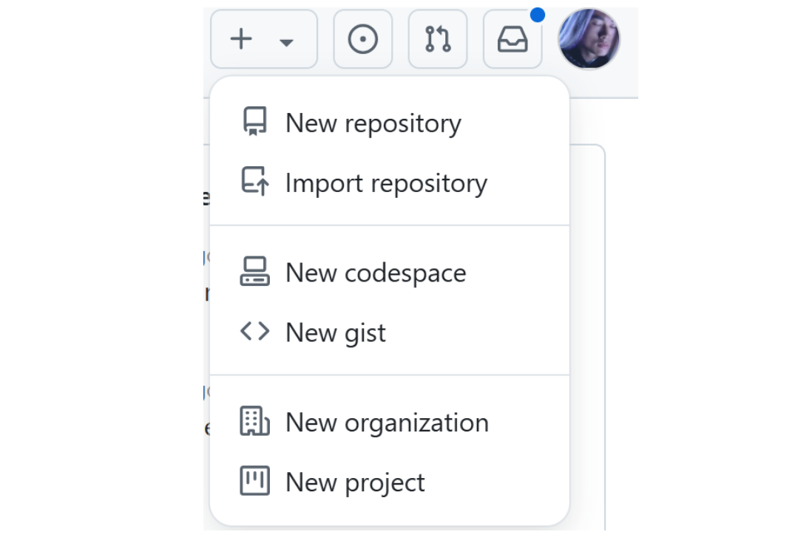
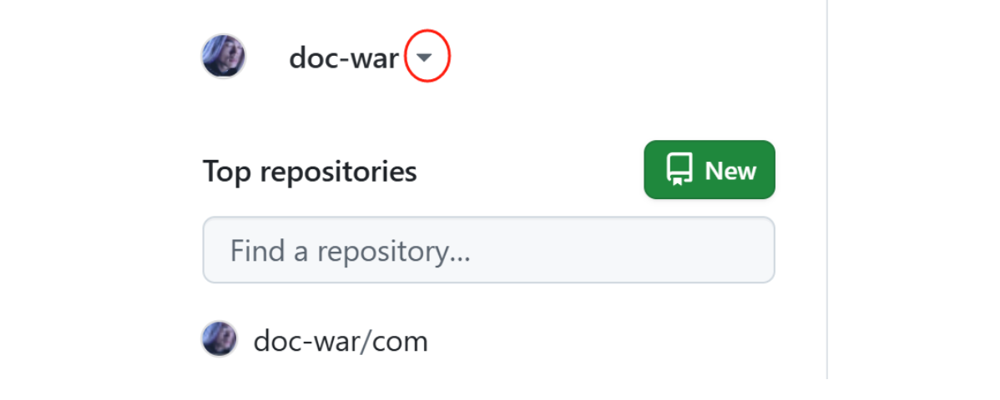
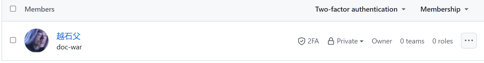
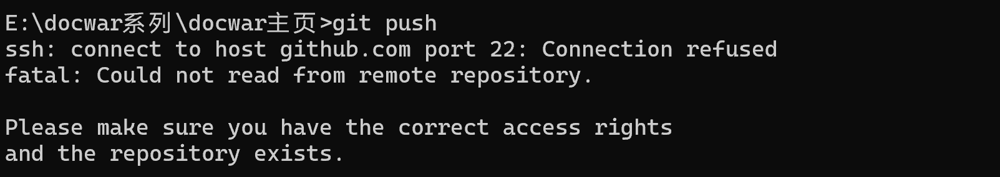
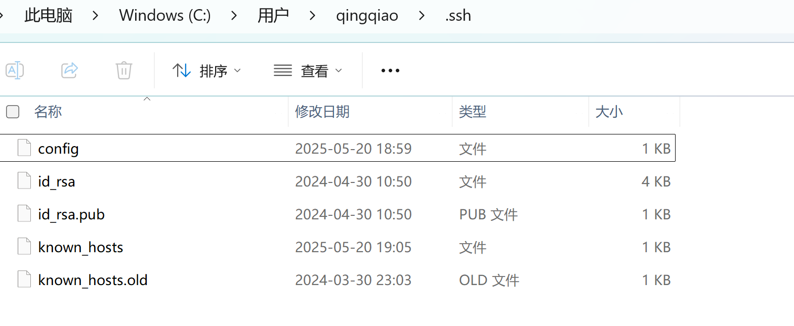
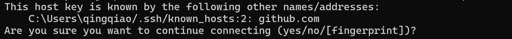

# git

git相关备忘

## 一、git基本概念

一般不需要关心

* project，是PDCA实施管理的功能面板。
* gist是代码片段
* Codespaces 是 GitHub 提供的一个 **基于云的 VS Code 开发环境**，可以让你在浏览器或本地 VS Code 中直接运行和调试代码，而不需要在本地安装依赖环境。
* import仓库，是一次性搬家工具，可以把一个已有的代码仓库 **从其他平台（或网址）复制迁移到 GitHub** 上，与下载 zip 上传不同，Import 是保留原始commit历史的完整迁移。



基础概念是仓库和账号的正交关系

* 个人账号https://github.com/doc-war
* 组织账号https://github.com/contextmarklanguage

账号是一个统一的命名空间

个人登录上去，作为管理员，默认显示个人项目，但可以点击三角快捷切换到组织。



## 二、git注意事项

维护git注意安全

#### 大小写不敏感

下面两个是同一个仓库

* https://github.com/modelcontextprotocol
* https://github.com/ModelContextProtocol

#### 命名抢注

对于协议、语言之类的基石概念，应该单拆组织，主要是确保命名不会被抢注，导致看上去不正统。

单拆组织不利用doc-war横向品牌的搭建，所以每一个组织项目需要主动暴露成员名，包括管理员，重新指回来

##### 公开成员

在组织的person中公开成员，则个人账号主页左下角必然显示加入的组织。



GitHub 的组织成员主要有以下几种类型的**角色**（权限）：

| 角色                               | 权限说明                                                     |
| ---------------------------------- | ------------------------------------------------------------ |
| Owner（拥有者）                    | 拥有组织的全部权限，包括成员管理、仓库控制、设置组织策略等。建议人数少且可信。 |
| Member（普通成员）                 | 默认角色。可以访问被授权的仓库和项目，权限取决于其在某个仓库中的角色（如 read/write/admin） |
| Billing Manager                    | 可查看和管理组织的账单信息，但无代码访问权限。               |
| Outside Collaborator（外部协作者） | 不是组织成员，但被邀请参与某个仓库的协作。不会出现在组织成员列表里。 |

#### SSH

每台电脑的安全push还是不能省的。详见[ssh](./ssh.md)

同时，https在开启2FA的情况下，经常会出现了连接超时问题。改成ssh连接更加稳定。

1、本地生成密钥对，然后将公钥配置到github

2、修改远程地址为 SSH：

```text
git remote set-url origin git@github.com:contextmarklanguage/spec.git
```


## 三、新仓库管理

创在github页面上刚创建git仓库时，默认是没有分支的，分支是从本地push上去的。所以最好先修改分支名，再remote添加或push。而在本地，如果从来没有add和commit，本地也是没有分支的。

所以，顺序是`本地commit` ——>`本地修改分支名`——>`push云端`

#### 从非空文件夹开始

基本都是非空开局

```yaml
## 一般顺序
git init
git remote add origin https://github.com/contextmarklanguage/spec.git 
git add .
git commit -m ''      ## 首次commit之后，本地才有可改的分支名
git branch -M main    ## 将本地默认的master分支改名main，然后才提交云端
git push -u origin main

## git remote add仅仅只是配置，换成下面的顺序也没毛病
git init
git add .
git commit -m ''    
git branch -M main   
git remote add origin https://github.com/contextmarklanguage/spec.git
git push -u origin main
```

如果中途换电脑，要先pull，避免冲突，这个时候，git remote add配置势必先行

```yaml
## 一般顺序
git init
git remote add origin https://github.com/contextmarklanguage/spec.git 
git pull origin main
```


## 四、穿墙

众所周知的原因，443端口极其不稳定，所以更建议采用ssh连接。
但是墙是万能的，22端口作为一个非http基本端口，反而更容易被完全性封杀，导致


所幸的是，github支持ssh over https


### 配置转发

新建一个无后缀的config文件。



写入如下内容
```yaml
Host github.com
  Hostname ssh.github.com
  Port 443
  User git
```

将ssh端口改成443

第一次push时，会提示你确认，输入yes即可。

