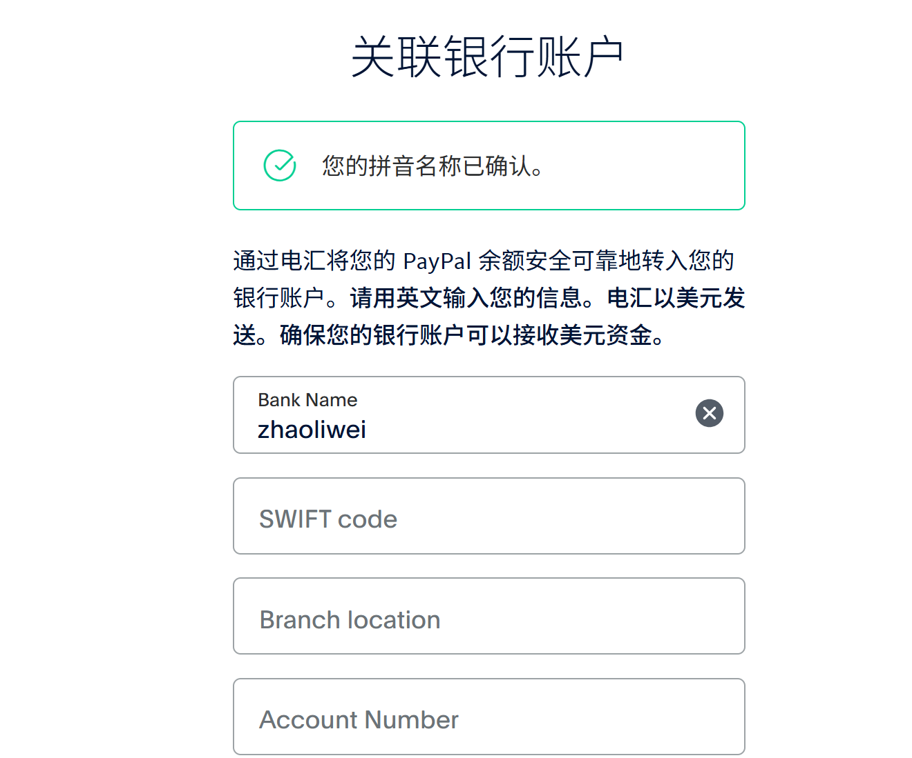
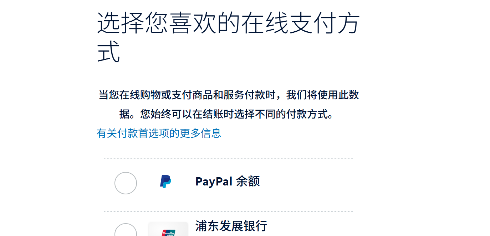

# Paypal支付

在国际范围内，paypal的支持比较主流。

## 注册流程

* 使用邮箱注册，最好是国际邮箱或大平台（越石）
* 同步会设置密码（比如94）
* 进行**身份验证**（需要用到银行卡，支持中国区的银联卡，比如浦发）

* 验证邮箱
* 关联收付银行卡（这时要求必须有美元账户）

但关联银行账号，可能不是绑定广告平台的强制要求，理论上，paypal可以先代收，只是暂时付不出来。

因为paypal相当于微信，所以也可以绑定多张银行卡！

### 关联银行账户的坑

银行支持的预留手机号可以不是自己的，而从gmail等邮箱注册过来，天然就传递过来了认证手机号，这两者不一致，就要求额外认证第二个手机号，但手机号又不是自己的，这导致短信验证码都发不出来。

这是不一致带来的巨坑。