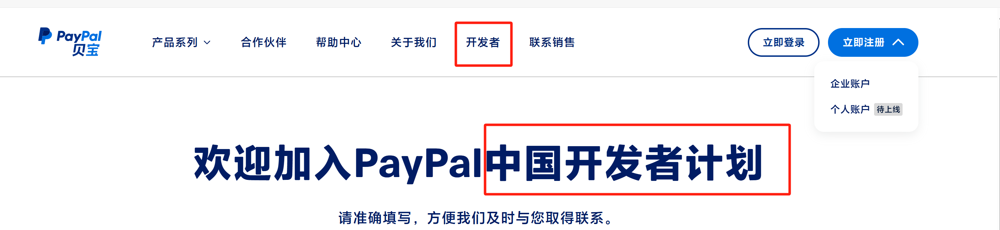
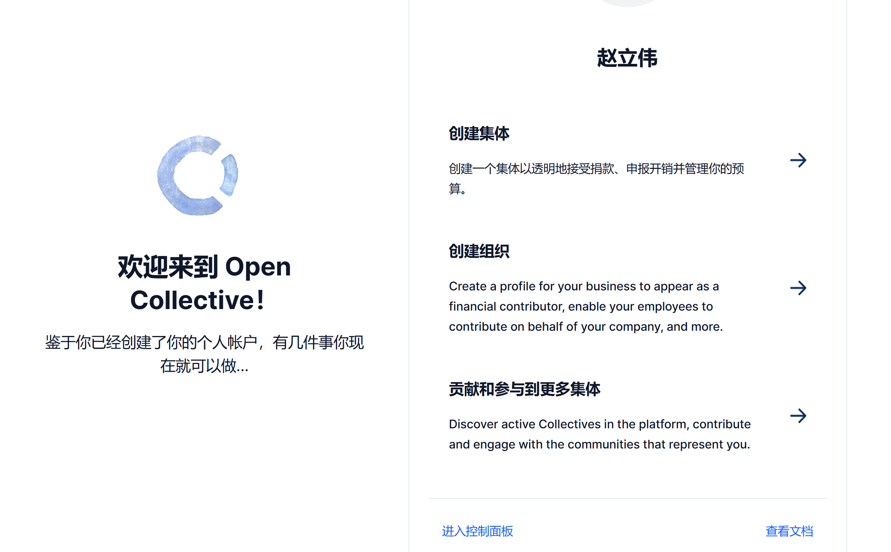
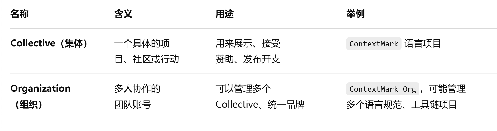
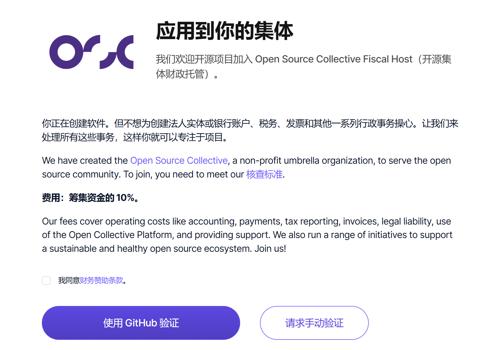
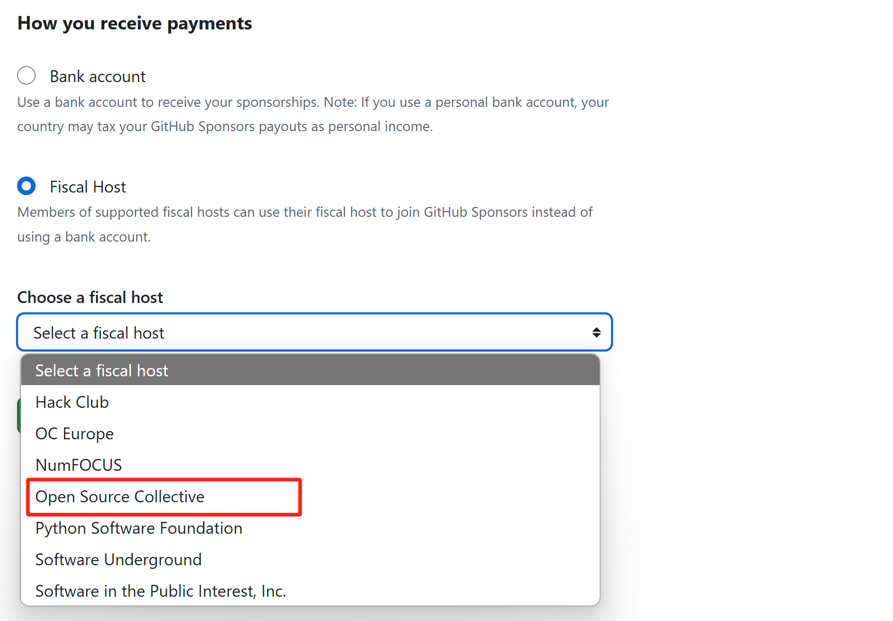

# 赞助收款账户

GitHub Sponsors 不直接支持中国大陆的银行卡收款。
只能通过 **间接方式**（如绑定 PayPal、Stripe，或依托OpenCollective基金会/组织）来实现资金收取。

## 一、银行账户

- **Stripe**：不支持中国大陆自然人直接开设 Stripe 账户。目前中国大陆只能借助通过香港公司、跨境企业来注册。
- **PayPal**：支持中国大陆的用户注册和接收款项（注意：部分 GitHub 赞助渠道不支持 PayPal，需要 Stripe）。
- **爱发电**：afdian.com国内门槛最低的平台，但是对国际可能不友好。

#### 解决方案推荐

如果你的赞助人选择的是可以使用 PayPal 的方式，你可以注册一个中国大陆 PayPal 账户，并绑定你国内的银行卡（一般为工行、建行等大银行），接收 PayPal 转账。

> 缺点：GitHub Sponsors 平台大部分是通过 Stripe 付款，PayPal 支持有限。

但好的是，PayPal提供针对性的解决方案

## 二、推荐方案

 该怎么做

| 步骤     | 操作                                                         |
| -------- | ------------------------------------------------------------ |
| ✅ 第一步 | 注册 PayPal（国际账户，支持收款）                            |
| ✅ 第二步 | 去 [OpenCollective](https://opencollective.com/) 注册，并创建 Sponsor 项目 |
| ✅ 第三步 | 在 OpenCollective 设置你的 PayPal 收款方式                   |
| ✅ 第四步 | 回到 GitHub Sponsors，选择 “Use a fiscal host” 来提交申请    |

#### 1. 注册OpenCollective

- 访问 https://opencollective.com/      （不强制实名，主要是zhao@man邮箱验证注册）

Collective 是项目，Organization 是团队，初期只需创建 Collective 就能开始赞助流程。

使用github开源项目验证

- 注册账号后，点击右上角 "Apply for Fiscal Host"
- 选择一个托管组织（**Open Source Collective**，接受开源项目）

### 2. 创建你的项目或个人 Sponsor 页面

- 设置介绍、License、GitHub 仓库连接等
- 配置你的收款方式为 PayPal（OpenCollective 支持 PayPal）

### 3. 返回 GitHub Sponsors

- 选择 **“Use a fiscal host”**
- 搜索并绑定你在 OpenCollective 上的组织
- 提交审核

