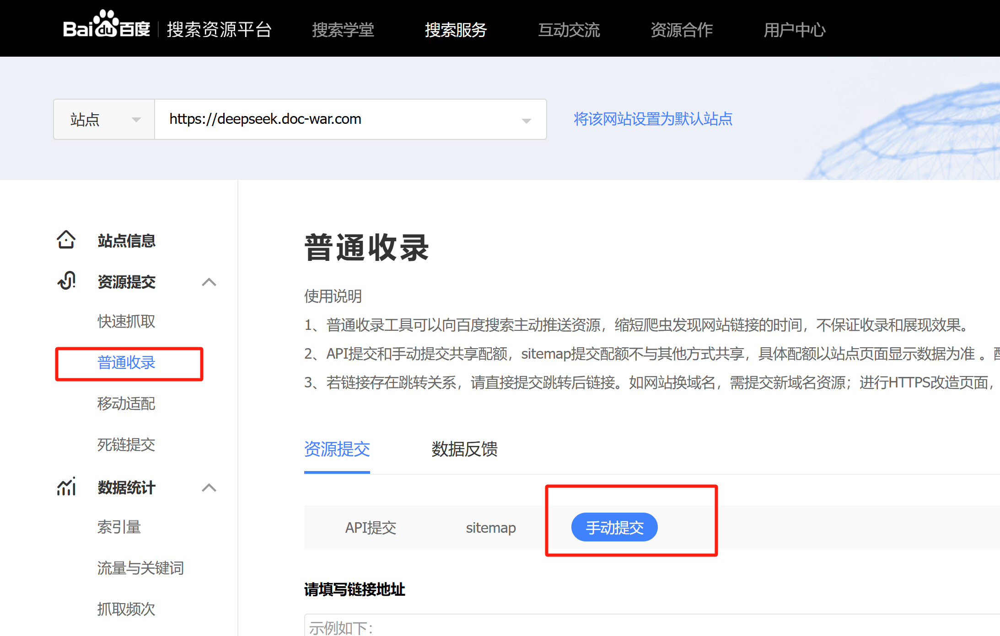
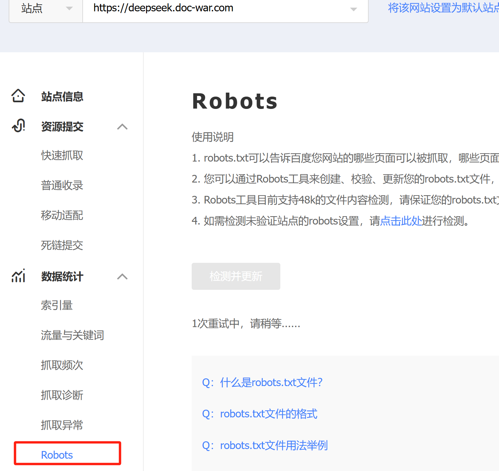

# 百度搜索

### 提交 sitemap

通过百度搜索资源平台

1. **登录**: 访问 [百度搜索资源平台](https://ziyuan.baidu.com/) 并使用你的百度账号登录。    （镜中）

2. **添加网站**: 点击“添加网站”并按照提示验证你的网站。

   

3. 提交 sitemap:

   - 在左侧菜单中选择“数据提交” -> “普通收录”。
   - 在“提交 sitemap”部分，输入你的 sitemap 文件的 URL（例如 `https://yourdomain.com/sitemap.xml`）。

   

   - 点击“提交”按钮。

   

   ### 直接检查robots

   