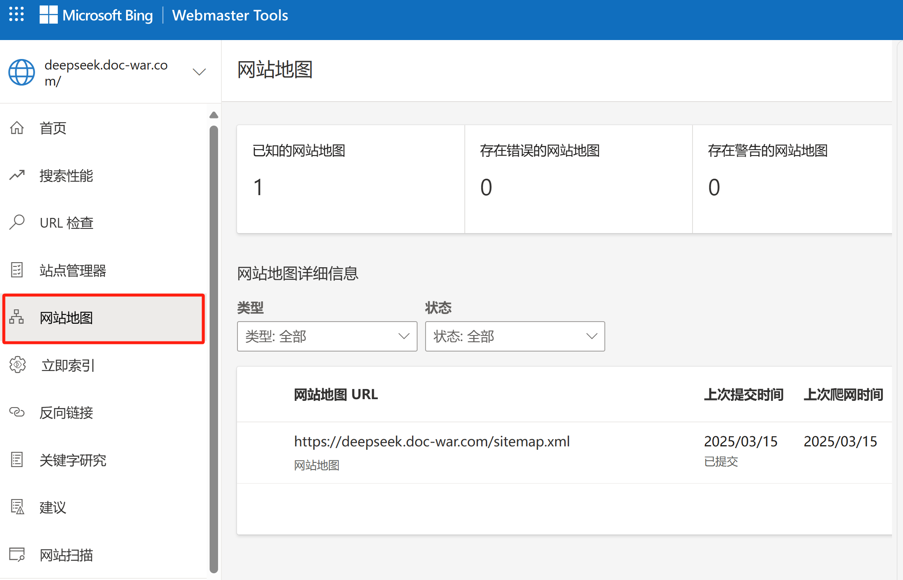
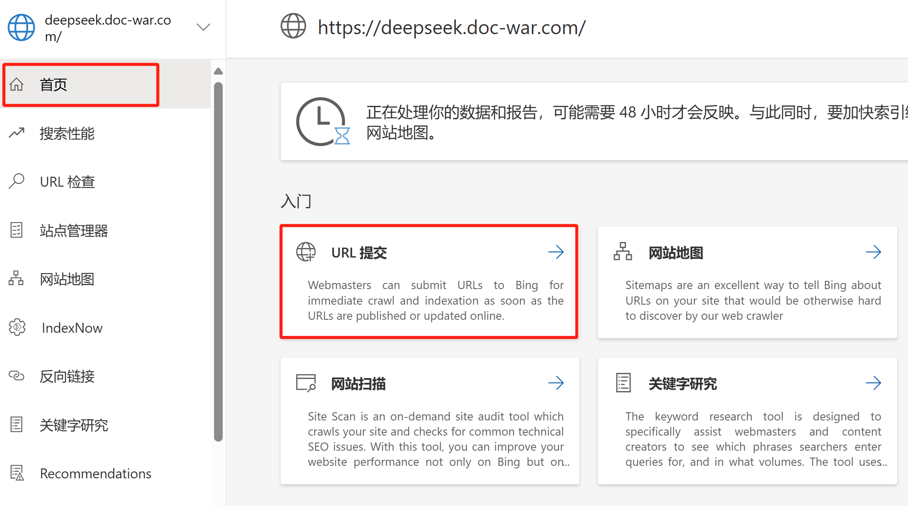

# Bing搜索

Bing 是微软的搜索引擎，支持提交 sitemap 和验证网站。

#### 提交 sitemap

1. 访问 Bing Webmaster Tools。
2. 登录你的微软账号（如果没有，请先注册）。    微软zhao@mandaren
3. 添加你的网站并验证所有权（可以通过上传 HTML 文件、添加 `<meta>` 标签或 DNS 记录等方式验证）。
4. 在左侧菜单中选择“配置我的网站” -> “Sitemaps”。
5. 输入你的 sitemap URL（例如 `https://yourdomain.com/sitemap.xml`）并点击“提交”。

#### 验证网站所有权

在验证过程中，Bing 会提供以下方法：

- **HTML 文件验证**：下载提供的 HTML 文件并上传到你的网站根目录。
- **`<meta>` 标签验证**：在网站的 `<head>` 部分添加 Bing 提供的 `<meta>` 标签。     持续保留
- **DNS 记录验证**：在域名管理面板中添加指定的 TXT 记录。

#### 主动提交

提交sitemap

提交单个页面

