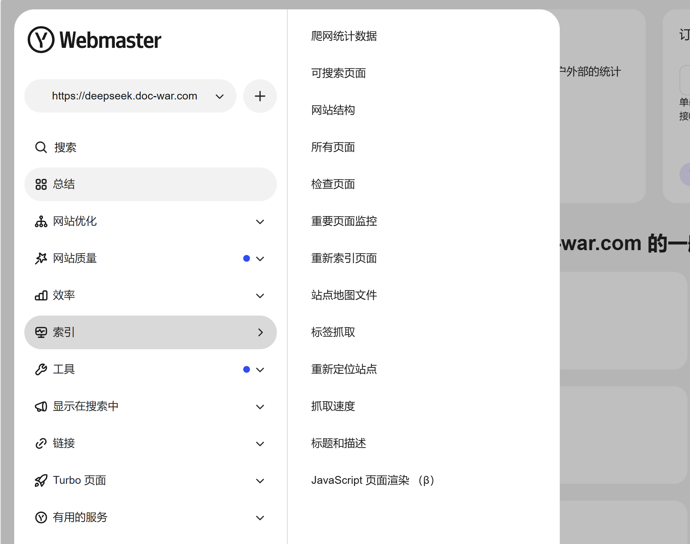

# Yandex搜索

Yandex 是俄罗斯的主流搜索引擎，也支持提交 sitemap 和验证网站。

#### 提交 sitemap

1. 访问 [Yandex Webmaster](https://webmaster.yandex.com/welcome/)。    （zhao@mandaren）
2. 登录你的 Yandex 账号（如果没有，请先注册）。

1. 添加你的网站并验证所有权（可以通过上传 HTML 文件、添加 `<meta>` 标签或 DNS 记录等方式验证）。
2. 在左侧菜单中选择“索引” -> “Sitemap 文件”。
3. 输入你的 sitemap URL（例如 `https://yourdomain.com/sitemap.xml`）并点击“添加”。

