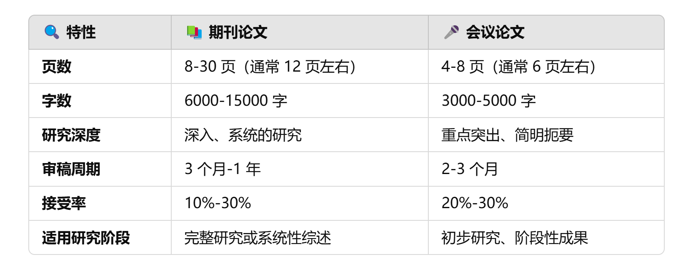

# 版权保护

各大平台（如 GitHub、IEEE、ACM、ArXiv 等）都有严格的时间戳和版本控制机制，以确保提交历史的安全性和不可篡改性。

实操详见[©](.©.md)

## 一、MIT 许可证

 MIT 许可允许**任何人复制、修改、发布**你的代码或项目，但有一个**关键条件：**他们必须在再发布时**保留原始的版权声明**。

- **创意、思想**本身不受版权保护，但**具体的实现、架构、设计文档、规范说明**是受版权保护的，并不仅仅是**代码实现**。即使文档版本以中文形式撰写，如果具有**独创性**，仍然享有版权。**对方直接使用核心架构，并改动部分表面特性发布**，即使是英文版本，也属于**“改编作品”**，同样应当遵守原始许可协议。

- MIT 许可保护的并不仅仅是**代码实现**，也包括**设计规范和文档**，如果对方重新发布但没有保留你的版权声明，仍然构成**违反 MIT 许可**。

## 二、溯源机制

各大平台（如 GitHub、IEEE、ACM、ArXiv 等）都有严格的时间戳和版本控制机制，以确保提交历史的安全性和不可篡改性。

以git为例，`commit` 是通过 SHA-1 哈希算法生成的，每个 `commit hash` 与代码的状态、作者信息、时间戳等绑定，一旦内容被修改，`hash` 会发生变化。

```markdown
SHA-1 = hash(提交内容 + 父提交哈希 + 提交作者 + 提交时间 + 提交消息)
```

对内容、提交时间、提交者信息等任何信息进行更改，都会导致 **SHA-1 哈希值**发生变化。

由于 Git 采用了“链式哈希”的方式，每个提交都引用其**父提交的哈希值**，因此篡改一个提交会破坏整个历史链，无法再保持一致性，成本非常高昂，如此，即使是平台内部员工，也难以掩盖痕迹。


## 三、相关概念

相关版权概念

#### 研究优先权

指最先提出某个概念、理论、方法或实验结果的权利。它用于确定谁是**原创发现的第一人**，并确保该研究成果的学术和知识产权归属。

#### 预印本

指的是**未经过正式同行评审**的论文，研究者可以提前上传自己的研究，获得**公开时间戳**。

ArXiv、Zenodo、ChinaXiv、bioRxiv、TechRxiv 等平台会为每篇论文分配 DOI，并记录上传时间，从而证明该研究的优先权。这个过程很快，几小时到一两天。

ArXiv主要聚焦于物理学、数学、计算机科学、统计学等领域的预印本，主要目的是提供一个快速发布新研究成果的平台。论文在 **arXiv** 提交后，会在 **几个小时到一天之内** 发布。若遇到审查或提交量较大时，时间可能稍有延迟，但通常不会超过 **1-2天**。

Zenodo定位不同，旨在为所有类型的研究人员提供一个存储、共享和发布的开放平台，他默认不提供同行评审服务，但提供了版本管理，通过实现DOI来支持。

#### 期刊、会议

正式期刊/会议，是学术研究的两大主要发表形式。研究人员向期刊投稿或者请求收录后，会经过**严格的同行评审**（Peer Review），确保论文质量。但这个审稿周期很长，短则3月，长过1年，接受率大约只有10%~30%。其中期刊比会议更加正式。



