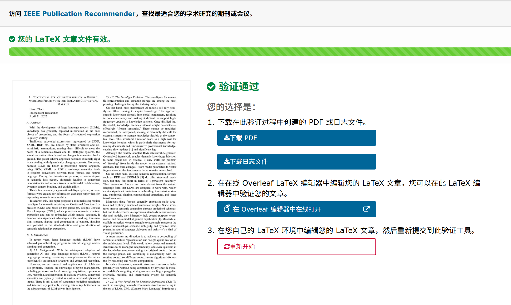
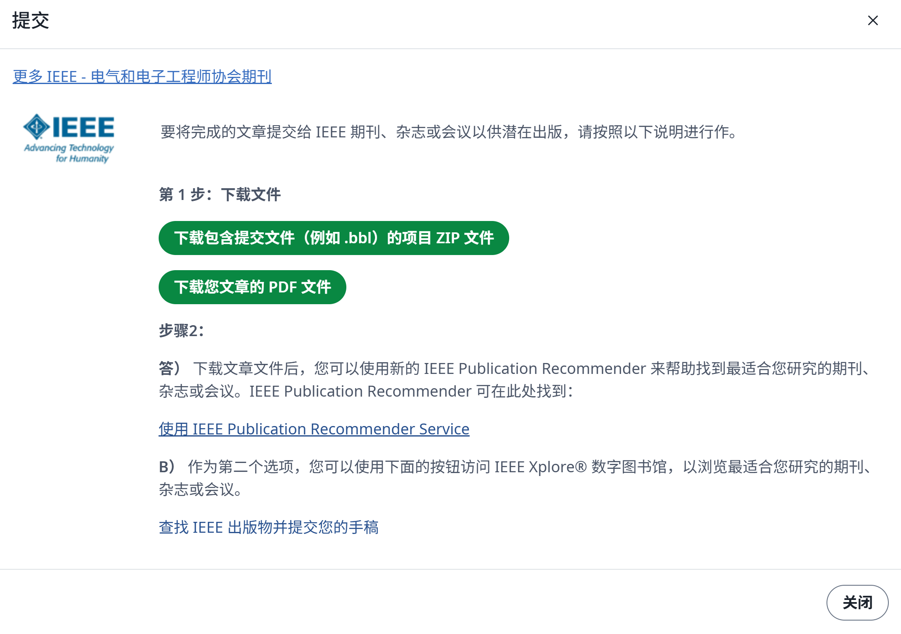
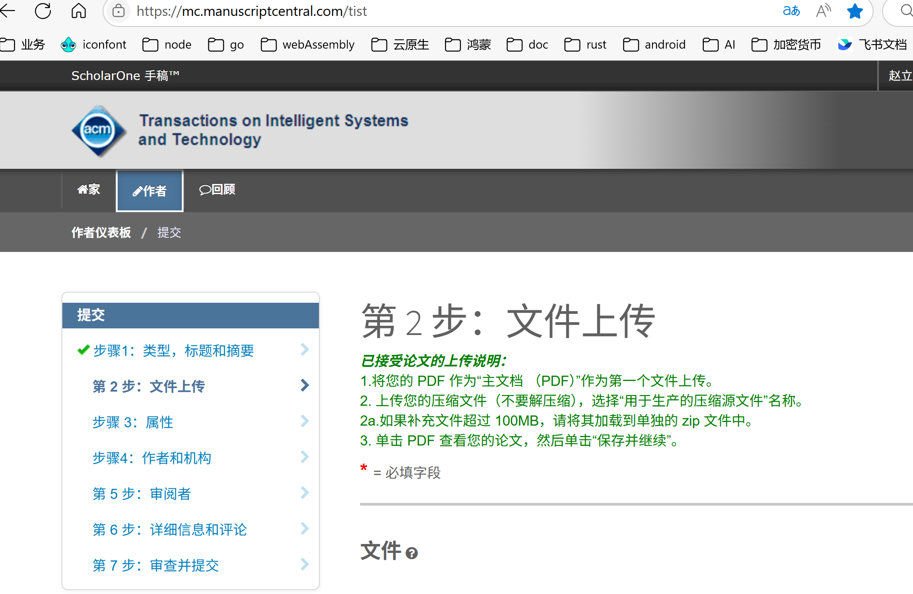
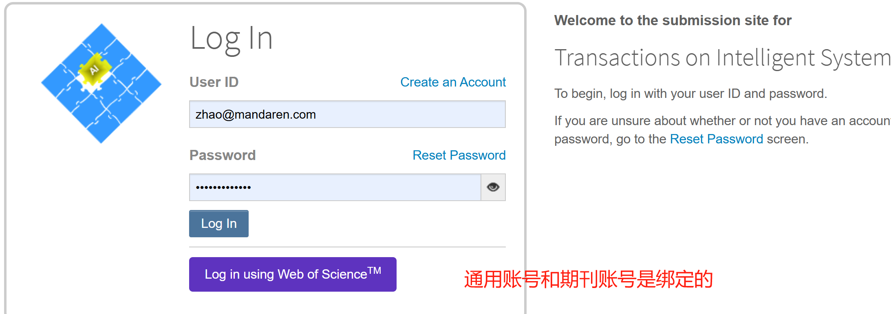
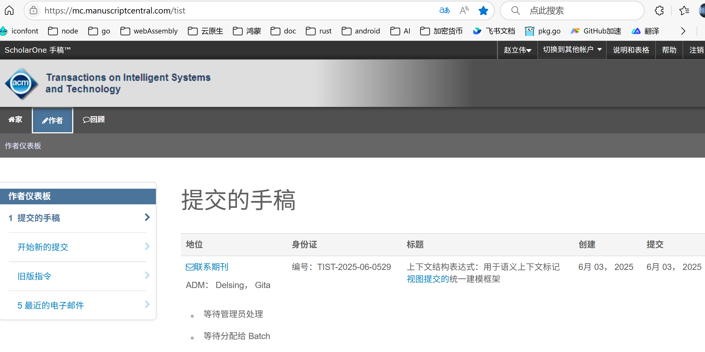
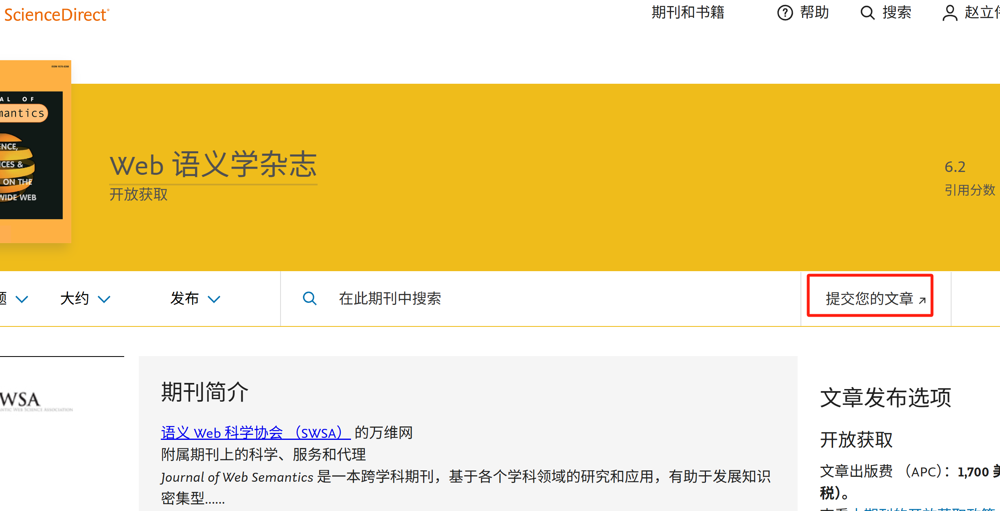

# 期刊投稿

## 一、Latex格式

期刊投稿需要转换成latex格式，typora转换的语法不兼容，比较麻烦。

基于IEEE提供的模板对typora导出物进行编辑，

latex语法分析器：https://latexqc.ieee.org/

可以跳到latex编辑器：https://www.overleaf.com/

直到修正出通过分析的版本。

再在latex编辑器右上角进行点击发布给IEEE，会有下面的提示

## 二、IEEE

IEEE 并不是一个统一投稿入口，而是一个期刊联盟，每个期刊（或期刊系列）都有自己的**独立投稿系统**，虽然大部分使用 **ScholarOne Manuscripts** 或 **IEEE Author Portal** 等平台。

创建通用的账号并与orcid关联是必要的。

### 投稿

比如，我如果选择[ACM Transactions on Intelligent Systems and Technology](https://mc.manuscriptcentral.com/tist)，则最终应该进入这里提交。

也可以投稿[JoWS | Journal of Web Semantics](https://www.sciencedirect.com/journal/journal-of-web-semantics)，在语义标记形式和本体论方面更加权威，但从 2024 年 1 月 1 日起，Journal of Web Semantics 将成为一本全金开放获取期刊，供所有人免费访问和阅读。2023 年 8 月 31 日之后提交的所有文章在经过同行评审和接受后均需支付文章出版费 （APC）。

