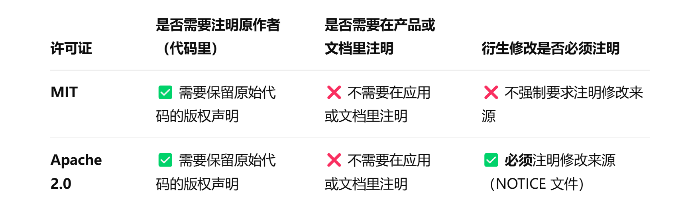

# license选择

## 一、区别

**版权**：保护作品的表达形式，如代码、艺术品、文档等。

**专利**：保护技术发明或新设计，通常需要申请并通过专利局审查。

**许可证**：是授权他人使用你拥有的知识产权（无论是版权还是专利）的协议，明确使用的范围、条件和限制。

## 二、宽松许可

严格许可没有未来，宽松许可。

在**宽松许可**中，以下几种是常见的选择，适合需要灵活性和最小约束的开发者：

- **MIT 许可证**：自由、简洁，广泛用于开源软件。
- **Apache 2.0 许可证**：比 MIT 更加注重专利授权，适用于需要专利保护的项目。
- **BSD 许可证**（2-clause 和 3-clause）：非常宽松，常用于学术和商业项目。
- **Zlib/libpng 许可证**：极简的宽松许可，常用于图形库等轻量级工具。
- **CC0 和 Unlicense**：完全放弃版权，适用于公共领域项目，最初面向数据集，也可用于软件领域。
- **ISC 许可证**：与 MIT 几乎一致，但语言表达上更简洁，只是没有MIT广泛。

## 三、Apache 2.0

MIT最大的问题是专利钓鱼和来源注明。

#### 专利条款

如果有人git项目发布之后还没流行的期间，基于你的项目申请了专利，你通常是无法阻止他们的专利申请的，甚至他反过来可以利用专利反诉你侵权。因为**MIT 许可证**本身并不涉及专利授权，没有明确的专利授权条款。

但Apach 2.0可以，它包含专利授权条款，确保贡献者不会因其贡献的代码而对使用者提出专利侵权诉讼。

如果某个贡献者之后对其贡献的代码提出专利诉讼，Apache 2.0 许可证将使贡献者失去他们的专利授权（即撤销授权）。这是一种保障机制，确保没有人通过专利诉讼来威胁开源项目的使用者。

这是七伤拳，首先自己不需要申请专利，因为没有商业价值，这一点所有宽松许可都是一样的。其次，别人不能反过来卡信息差，用你的项目去申请专利并垄断你的技术。

#### 注明来源

作为一个小开发者，如果希望衍生项目，明确指向github项目作为修改来源，而不仅仅是保留版权声明，则Apache天然更适合。

并且Apache 2.0 许可证不会强制绑定仓库地址，所以你可以随时在新版本里更新信息，**关键是做好迁移公告，尽量保持旧仓库的可访问性**（比如 README 说明或者 GitHub 自动重定向）。