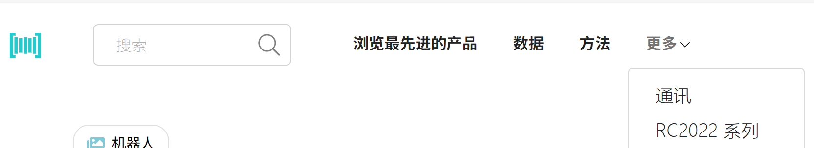
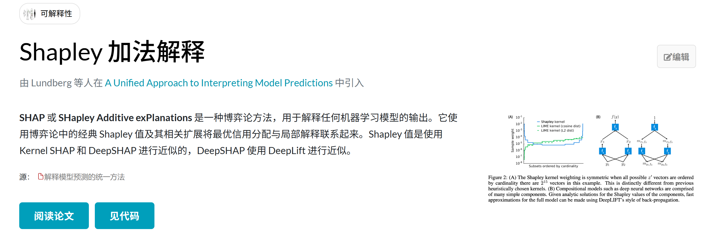

# paperswithcode

传统学术平台体验实在糟糕，实际上，目前非常主流的arxiv预印本平台，影响力大但流量并不大，paperswithcode是开源运动的其中一个流量最大的代表。

## 一、概况

| 平台                   | 月均访问量               | 主要用户                  | 来源                        | 备注                            |
| ---------------------- | ------------------------ | ------------------------- | --------------------------- | ------------------------------- |
| **Papers with Code**   | **700–900 万**           | AI/ML/NLP 研究者、工程师  | Google、GitHub、HuggingFace | 被视为“AI 论文+代码”标准入口    |
| **arXiv.org**          | **500–700 万**           | 理工学术圈                | 直接访问、Google Scholar    | 论文归档源头，传统入口          |
| **TechRxiv**           | **10–30 万**（保守估计） | 工程、CS 作者             | IEEE/搜索引擎               | IEEE 旗下的预印本平台，流量有限 |
| **ResearchHub**        | 5–15 万                  | Web3 科研圈、少量生物医师 | 直接访问/推特/X             | 有潜力，但尚未主流              |
| **DeSci 平台（集合）** | 每个平台几千–几万        | Web3 开发者、研究者       | Discord/推特为主            | 分散、小众，但活跃度高          |

Papers with Code 最主流：

- 机器学习领域的标准平台，**连接论文和代码实现**
- 已成为ML研究社区的基础设施
- 被学术界和工业界广泛采用

换而言之，Paperswithcode是一个AI垂直领域的标准平台，只有踩在趋势主干线上，才可能借助新的需求维度架构，铸造出新范式的标准平台。

## 二、账号

doc-war

zhao@man

## 三、业务架构

业务是围绕读者和作者设计的。

### 平台维度

从官网导航栏可以看出，从作者的角度，Paperswithcode强调的维度：**产品**、**数据集**、**方法**、基准测试，而这些方面，强调了论文和代码的延续性。

由于侧重不同，Paperswithcode不负责作为论文发布的源头，而是链接到上游的arxiv和下游的github平台，进行展示维度的聚合与关联。

### 门户维度

从读者的角度，Paperswithcode定义了大量的子领域，进行了上述维度的分类、检索、推荐、排名。

从用户侧看，这是一个很好的系统性的学习平台，一个非常不错的文档平台设计。

### 从CML看

CML论文确实不适合直接发布到 Papers with Code

因为：

* Papers with Code 以“有 benchmark 的 AI 方法”为核心，CML 更像是**语言设计**或**系统论文**

* 若没有与 GLUE、MMLU、COCO 等 benchmark 对应的“数值评测”，无法进入榜单系统
* Papers with Code 建立了一套 Task/Method/Dataset 分类体系，CML 没有明确归属（可能属于 DevTools 或 Infra）

综上，

* ❌ **不属于标准 ML 方法任务**
* ❌ **没有公开评估指标/排行榜**
* ❌ **与 AI 方法分类体系不兼容**

CML最终应该是以“数据集工具”、"可视化框架"类项目示人，比如语料分析工具、结构注释系统，也可以包装为一个“支持 NLP task 的工具”放进去（如：标注辅助工具）

或者归类到“数据增强”下面的“语义增强”（Semantic Augmentation）。