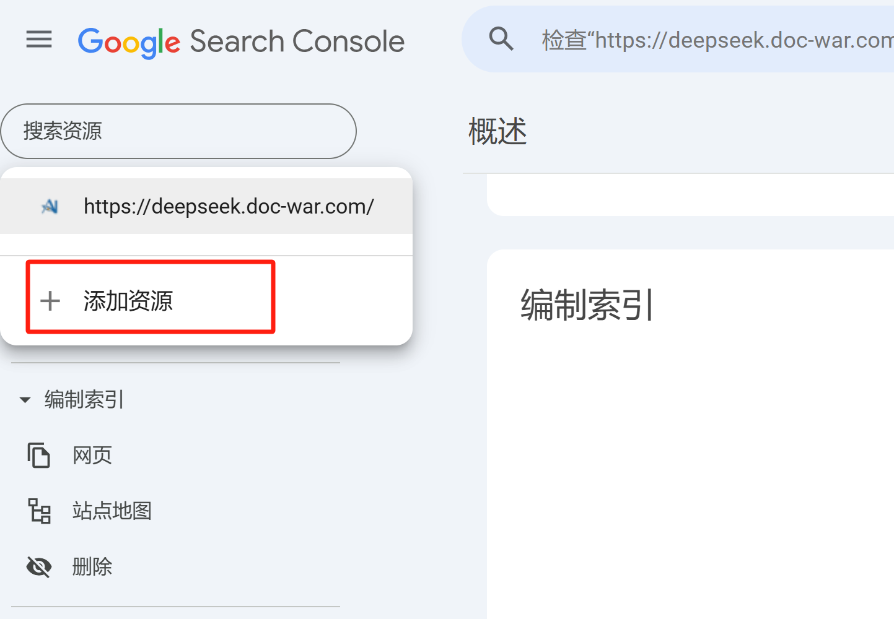

# Google搜索

#### Google Search Console提交

- 访问  [Google Search Console](https://search.google.com/search-console)     yueshif
- 选择 **"添加资源"**，然后输入你的 **网站 URL**（如果是 `https://example.com/docs/`，则填写 `https://example.com/`）

- 按照 Google 的指引验证你的所有权（常见方法有 DNS 记录、HTML 文件上传等）

#### 提交 sitemap

- 在 Google Search Console 主页，选择你的 **网站**

- 在左侧导航栏中，点击 **"索引" > "站点地图"**

  

- 点击 **提交**
