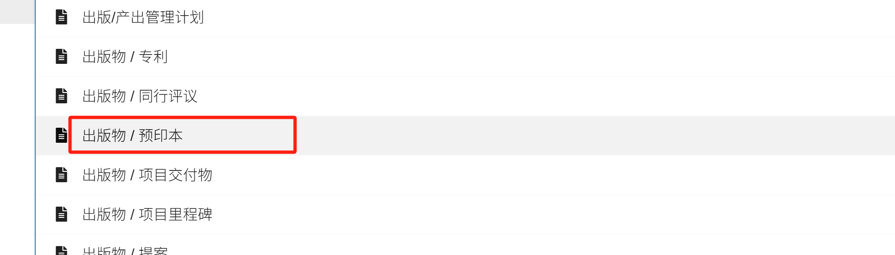

## 版权©实操建议

协议、语法本质上属于一种**创意设计**，如果你的语法设计具备一定的**独创性**，那么它是受到**版权法保护**的。
但要注意，单纯的**想法或概念**不能受到版权保护，只有具体的实现（如规范文档、代码、示例等）才受到保护。

主流学术数据库：

https://ieeexplore.ieee.org/  全球电子图书馆

[ACM 数字图书馆](https://dl.acm.org/)  美国计算机协会

[arXiv.org](https://arxiv.org/)    预印本存档平台

[Zenodo](https://zenodo.org/)      开放科学存储平台

内容社区

*  Google Scholar，百度学术之类的平台流量更低，不做考虑。
* [媒介：阅读和撰写故事](https://medium.com/)    知乎、简书类似的产品。
* 如果你的目标是进行**全球范围的内容创作**，Medium可能更合适；如果你是中文创作者，并且注重**知识性内容**，知乎可能是更好的选择，流量最大；而如果你偏向**个人创作或随笔**，简书可能会更符合你的需求。传播而言，这三个是较好的选择。
* 投资人社区是一个较好的影响力支点：**雪球**、**Reddit - r/Investing** 和 **r/StockMarket**。

## 五、实操建议

#### 账户

| 网站                            | 定位                                                         | 账号                                                         |
| ------------------------------- | ------------------------------------------------------------ | ------------------------------------------------------------ |
| [zenodo](https://zenodo.org/)   | 存储、共享和发布的开放平台（[CSE模型](https://zenodo.org/records/15255535)） | github                                                       |
| [arXiv.org](https://arxiv.org/) | 预印本平台                                                   | **邮箱：** zhao@mandaren.com **用户名：** zhaoliwei 不支持Google Authenticator等2FA功能 |
|                                 |                                                              |                                                              |

**快速证明原创性**并防止抄袭，可以**先在 GitHub 和 Zenodo 上存档项目**，然后再选择发布到学术期刊或 ArXiv。

注意，顶级会议（如NeurIPS、CVPR）和期刊（如IEEE TPAMI）明确禁止重复投稿。投稿系统（如OpenReview、CMT）常要求声明“未在其他地方发表或审稿中”。

不同出版方政策略有差异：

- **IEEE**：要求完整版权转让，允许arXiv和个人网站分享。
- **ACM**：可选择版权转让或开放获取（CC BY），也允许预印本。
- **NeurIPS/ICML**：要求独占发表权，鼓励arXiv。

论文投稿时，可能存在**版权转让方式选择**：如果你的1500字论文投稿到计算机领域会议（如AAAI短篇论文）或期刊（如IEEE Signal Processing Letters），被接受后可能需要签版权转让协议。这只影响论文文本的版权：

- 出版方（如IEEE）获得复制、分发的权利（如收录到ACM Digital Library）。
- 你仍然是作者，学术贡献归你。不影响论文内部的技术的许可协议。

#### 第一步、许可证

选择适当的开源许可证。但考虑特别条款，手动编写license.md。

该license内容应该确保在后续的每一个平台都保持一致。因为有特别条款，都需要手动进行设置，要避免误操作，以确保两个平台的版权声明保持一致。

推荐做法：

- 在 **GitHub** 上将自定义 Apach 2.0 许可证写入 `LICENSE` 文件。
- 在 **Zenodo** 上传时选择 `Other` 许可证，并粘贴自定义条款内容。
- 在 Zenodo 的 `Description` 中加上 GitHub `LICENSE` 文件的链接，方便引用时核对。

#### 第二步、发布github

发布git项目， 借助GitHub Pages上构建 Markdown 网站

- 你可以使用默认的 [Jekyll](https://jekyllrb.com/) 或其他静态网站生成工具来生成你的技术协议网站。
- 创建 GitHub 发布版本（Release）：

- 为了与 **Zenodo** 集成，你需要在 GitHub 上创建 **Release**。每当你完成一组文档或更新时，可以在 GitHub 仓库中创建一个新的 Release。每个 Release 都是 GitHub 上发布的一个版本。
- 你可以选择将 GitHub 上的 **Markdown 网站** 中的相关文件（例如生成的 HTML 文件或 Markdown 文件本身）作为 Release 上传。
- 通过 Release，你可以提供一个稳定版本的代码或文档，这将作为 Zenodo 同步的内容。

#### 第三步、与 Zenodo 集成

一旦你在 GitHub 上创建了 Release，GitHub 可以与 Zenodo 进行集成，将该版本上传到 Zenodo 并为其生成 DOI。

- **Zenodo 与 GitHub** 的集成是基于 **Release 版本** 的。这意味着，你的 **GitHub Pages 网站** 中的所有文件并不会自动与 Zenodo 同步，但你可以通过创建 Release 版本来上传相关文件。
- 每个 **GitHub Release** 都可以同步到 **Zenodo**，并且 Zenodo 会为该版本生成一个 DOI。你可以在 Release 说明中提供该版本的详细信息。
- 可通过 **GitHub Actions** 来设置一定规则的自动化流程，在发布时自动生成并上传文件到 Zenodo。

- **步骤**：
  1. 在 GitHub 仓库中，转到 `Settings` -> `Integrations` -> `Zenodo`，并进行连接。
  2. 每当你创建新的 Release 时，Zenodo 会自动同步该版本，并生成一个 DOI，用于引用。
- 你可以在 Zenodo 上查看和下载通过 GitHub Release 上传的版本。

#### 第四步、发布ArXiv

GitHub 和 arXiv 目前没有直接的自动集成。

将Zenodo 作为中间桥梁。考虑以下流程：

1. **GitHub 与 Zenodo 集成**：每次 GitHub 创建 Release，Zenodo 会生成新的 DOI。
2. **下载 Zenodo 上的 PDF 文件**。
3. **手动上传 PDF 文件到 arXiv**，并在 `Comments` 中附上 Zenodo 的 DOI 和 GitHub 的链接。
4. **选择分类**：你需要选择预印本的分类（如计算机科学、物理学、生命科学等），并可能提供一些附加的分类信息，帮助其他研究者更容易找到你的预印本。
5. **元数据填写**：除了PDF，你还需要填写一些基本的论文信息，包括论文标题、摘要、作者信息、提交日期等。你还可以选择在预印本平台上公开或者隐藏部分内容。

一旦上传并通过arXiv平台审核，你会获得一个DOI，这样你的预印本就有了一个永久的、可引用的标识。

#### 第五步、发布正式论文

发布正式论文到IEEE和ACM，与发布到ArXiv在提交操作方面是相似的，差别在于业务上的正式定位。

IEEE 明确允许作者在 **arXiv**、**TechRxiv** 或其他预印本平台发布文章的预印本版本（preprint），在提交到 IEEE 期刊或会议之前无需撤回。在正式发表后，你可以更新 arXiv 页面，添加 IEEE 发表的 DOI，并注明该版本已通过同行评审。

注意，IEEE 和 ACM 都要求在正式发表的版本中注明与 arXiv 预印本的区别，通常在论文的 **Acknowledgment 或 Introduction 部分** 标明。